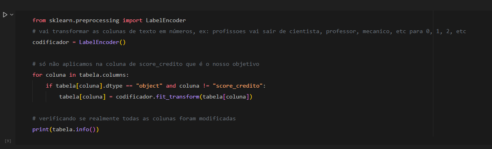

# 💳 Score de Crédito Inteligente
<p align="center">
  
  
  
</p>

<div align="center">
  
</div>

## 📋 Sobre o Projeto
O **Score de Crédito Inteligente** é um projeto de *machine learning* que realiza a análise e previsão do score de crédito de clientes com base em dados comportamentais e financeiros. A proposta é demonstrar como técnicas simples de *data science* e modelos supervisionados podem ser aplicadas de forma prática no contexto financeiro.

Este projeto pode ser utilizado como base para soluções de análise preditiva em empresas de crédito, fintechs, ou estudos acadêmicos.

## 🚀 Como Executar o Projeto
1. **Clone o repositório:**

   ```bash
   git clone https://github.com/seuUsuario/score-credito-ml.git
   ```

2. **Instale as dependências necessárias:**

   ```bash
   pip install pandas scikit-learn
   ```

3. **Abra o Jupyter Notebook e execute as células sequencialmente:**

   ```bash
   jupyter notebook credito.ipynb
   ```

## ⚙️ Funcionalidades
* 📊 Visualização e pré-processamento de dados de crédito
* 🧮 Transformação automática de colunas categóricas
* 🔍 Teste comparativo entre Random Forest e KNN
* 🔮 Previsões personalizadas para novos clientes
* 🧩 Geração de métricas de performance e análise de features importantes

## 📂 Estrutura do Projeto
```
├── credito.ipynb                          # Notebook principal do projeto
├── clientes.csv                           # Base de dados com histórico dos clientes
├── novos_clientes.csv                     # Novos dados para previsão
├── preview-notebook.png                   # Imagem ilustrativa do notebook
└── README.md                              # Documentação do projeto
```

## 🔍 Resultados Obtidos
* Acurácia média obtida pelos modelos:

  * **Random Forest**: `≈ 82%`
  * **KNN**: `≈ 75%`
* As variáveis mais relevantes para o score foram:

  * Comportamento de pagamento
  * Gasto com cartão de crédito
  * Renda mensal

## 💪 Como Contribuir
1. Faça um fork do projeto.
2. Crie uma nova branch: `git checkout -b feature/nova-feature`
3. Faça suas alterações e commit: `git commit -m 'Adiciona nova feature'`
4. Envie para o seu fork: `git push origin feature/nova-feature`
5. Abra um Pull Request 🚀

## 📝 Nota Final
Este projeto foi desenvolvido com o objetivo de aprendizado e experimentação com *machine learning*, e pode ser adaptado e expandido para contextos profissionais com mais dados e integrações.

<br>

---

<p align="center">
  Desenvolvido por <a href="https://github.com/seuUsuario">Ricardo Andreotti Gonçalves</a> 🧑‍💻
</p>

---
